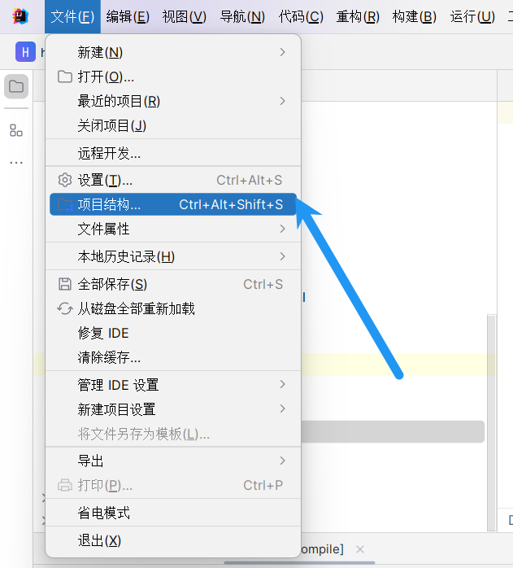
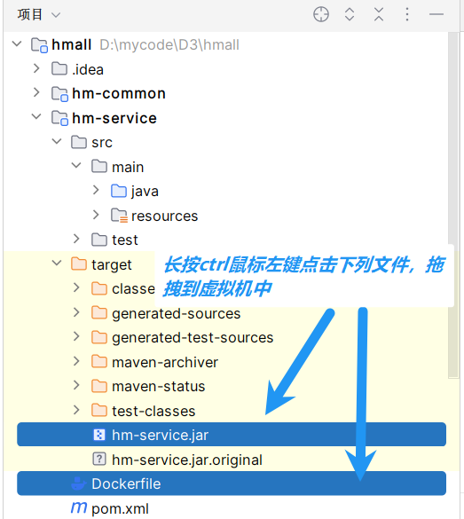

# 停止mysql服务
systemctl stop mysqld

# 卸载mysql相关包
yum remove -y mysql* mariadb*

# 删除数据和配置（可选）

rm -rf /var/lib/mysql
rm -rf /etc/my.cnf

然后创建一个通用网络：

同一个网络下的容器可以直接用 **容器名互相通信**，不需要记 IP。

网络和外部隔离，避免容器 IP 冲突。

可以配合 `--network hm-net` 在 `docker run` 时指定容器加入这个网络。

```Bash
docker network create hm-net
```

使用下面的命令来安装MySQL：

```虚拟机关机重启后启动sql:docker start mysql
docker run -d \
  --name mysql \
  -p 3306:3306 \
  -e TZ=Asia/Shanghai \
  -e MYSQL_ROOT_PASSWORD=123 \
  -v /root/mysql/data:/var/lib/mysql \
  -v /root/mysql/conf:/etc/mysql/conf.d \
  -v /root/mysql/init:/docker-entrypoint-initdb.d \
  --network hm-net\
  mysql
```

此时，通过命令查看mysql容器：

```Bash
docker ps
```




在虚拟机中分别输入：
docker build -t hmall .
(查看docker相关配置信息)
docker images
docker ps

docker run -d --name hm -p 8080:8080 --network hm-net hmall
(查看docker日志)


能不能用AOP替代openfeign


JDK的url connection不带连接池
用OKHttp优化

订单，购物车，交易。。。中都有查询商品业务那就意味着都要调用item client
纵向按业务拆分，横向按功能拆分
处理复用的代码：
1. 提取公共代码创建新的微服务模块，调用该模块的接口与实体类（具有代码的通用性，但增加了代码的耦合度，相当于所有微服务访问一个api,不同微服务接口要一起去维护）
2. 在原有的模块下继续拆分，提取复用代码作为原模块的子模块（子模块分为接口与实体类实现类），其他微服务访问该子模块的接口与实体类，需要调用时引入该子模块的坐标放在pom.xml中,具备相关功能了就直接调用了（如果每个微服务都拆分子模块，那代码变得十分复杂，但耦合度极低）


在本项目中创建了hm-api，其子目录client用于复用的代码暴露接口


1. 启动 Docker 服务
   首先确保 Docker 服务处于运行状态：

bash
# 检查Docker服务状态
sudo systemctl status docker

# 如果未运行，启动Docker服务
sudo systemctl start docker

# （可选）设置Docker开机自启，避免每次手动启动
sudo systemctl enable docker
2. 启动 MySQL 和 Nacos 容器
   根据之前的启动方式选择对应命令：
   方式一：如果使用 Docker Compose
   在docker-compose.yml文件所在目录执行：

bash
# 启动所有服务（后台运行）
docker-compose up -d

# 查看启动状态
docker-compose ps
方式二：如果是单独启动的容器
bash
# 查看所有容器（包括已停止的），获取容器名称或ID
docker ps -a

# 启动MySQL容器（假设容器名为mysql）
docker start mysql

# 启动Nacos容器（假设容器名为nacos）
docker start nacos

# 确认容器状态
docker ps


3. 验证启动结果
   MySQL：可通过docker exec -it mysql mysql -uroot -p尝试登录验证
   Nacos：访问 http://虚拟机IP:8848/nacos，默认账号密码均为nacos

如果启动失败，可通过docker logs 容器名查看日志排查问题（例如docker logs nacos）。

defaultConfiguration = DefaultFeignConfig.class
# 关闭所有Docker服务
docker stop $(docker ps -q)
# 如果未运行，启动Docker服务
sudo systemctl start docker
# 启动MySQL容器（假设容器名为mysql）
docker start mysql
# 启动Nacos容器（假设容器名为nacos）
docker start nacos